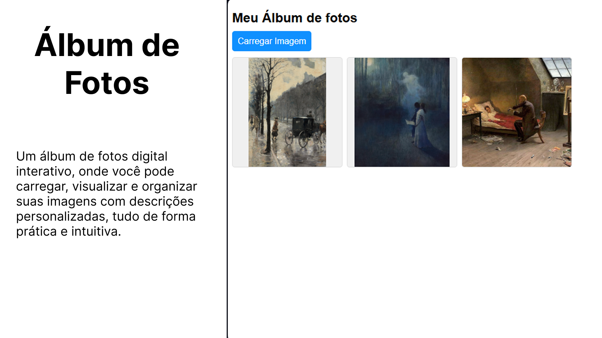

# 📸 Álbum de Fotos Interativo  

  

Este projeto foi desenvolvido como parte do curso **“JavaScript do Básico ao Avançado + 132 Projetos Reais”** do Clevison Santos.  

A ideia foi praticar conceitos fundamentais de **JavaScript**, como manipulação do DOM, eventos e uso do **FileReader**, criando uma aplicação simples e funcional para gerenciamento de imagens.  

## 🚀 Funcionalidades  

- Carregar várias imagens diretamente do computador.  
- Adicionar uma descrição personalizada para cada foto.  
- Visualizar as imagens em tela cheia dentro de um modal interativo.  
- Remover fotos da galeria quando desejar.  

## 🎯 Objetivo  

O objetivo principal foi exercitar habilidades práticas no desenvolvimento web, unindo **HTML, CSS e JavaScript** em um projeto completo e interativo.  

## 🔗 Acesse o Projeto  

🌐 [Versão Online no GitHub Pages](https://thamiressarges.github.io/album-de-fotos)  
